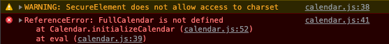
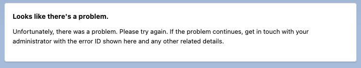

# FullCalendar LWC test

Run `install-scratch.sh` to setup a scratch org with the test component.
The install script will open a browser with a Lightning tab.

With Locker active the FullCalendar library will not load:

Enable **Locker Web Security (beta)** in Setup > Session Settings

Refresh the Lightning tab with the test component.
Notice that the component still doesn't work and there's a CSP error.

